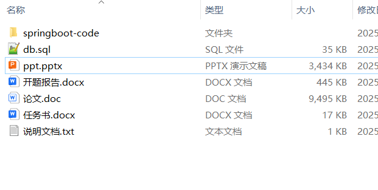

# springboot_luggage_storage_project_application_campus_health_station

📦 SpringBoot多功能项目仓库 🎯

本仓库汇集了三个基于 **Spring Boot** 开发的高实用性项目，涵盖**箱包存储管理**、**项目申报管理**、**校园健康管理**等多个领域，适用于**企业**、**校园**、**科研机构**，助力提升**存储管理**、**项目审批**、**健康服务**的效率，为不同应用场景提供智能化解决方案！🚀

🎒 **箱包存储系统** —— 具备**箱包存储管理**、**存取登记**、**取件提醒**、**存储时长控制**等功能，实现**智能存包**和**安全管理**，适用于**车站行李寄存**、**学校自助存包**、**商场寄存柜**等场景 🎒🔐

📑 **项目申报管理系统** —— 提供**项目申请**、**审批管理**、**项目进度追踪**、**文档存档**等功能，优化**项目申报流程**，提高**项目审核效率**，适用于**科研课题申报**、**企业资助申请**、**政府项目管理** 📄✅

🏥 **校园健康驿站管理系统** —— 具备**健康监测**、**健康驿站预约**、**医护值班安排**、**健康档案管理**等功能，助力**校园健康管理**，为师生提供智能化**健康监测与医疗支持** 🏫💊

**项目部署说明**✨：

推荐使用：**谷歌浏览器**

**后台地址**😎

http://localhost:8080/springboot/admin/dist/index.html

**前台地址**😎

http://localhost:8080/springboot/front/index.html

在**src\main\resources\application.yml中**编辑数据库配置🎉										
url:jdbc:mysql://127.0.0.1:3306/springbootuseUnicode=true&characterEncoding=utf8&useJDBCCompliantTimezoneShift=true&useLegacyDatetimeCode=false&serverTimezone=UTC
username: root
password: 123456

**文档预览**👀

**其他项目合集**✨

